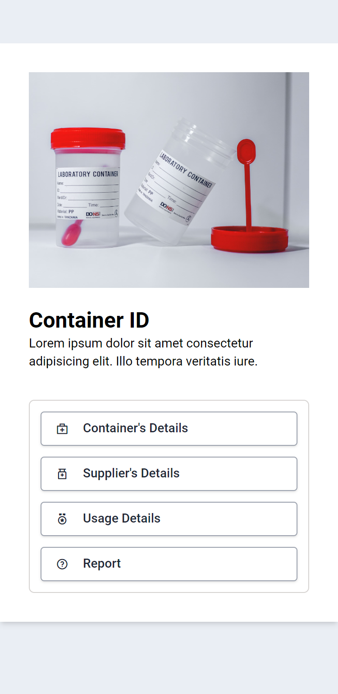

# Mathew Joseph

## About Me

I'm [Mathew Maro](https://github.com/theomaro/theo), a full-stack JavaScript developer working out of Mbinga, Tanzania 🇹🇿. My expertise lies in developing web 🌐 applications. I provide top-notch work that leads to the best projects.

## Skills and Experience

### Web Technologies

- HTML and CSS
- JavaScript (Node.js)
- TypeScript
-  MySQL

### Framework and Libraries

- Tailwind CSS
- Svelte/SvelteKit JS
- Express JS

## Projects

|                | SciMathQ                                                         | Medical Lab Scan                                          | Manage Landing Page                                        | Bookmark Landing Page                                          |
| -------------- | ---------------------------------------------------------------- | --------------------------------------------------------- | ---------------------------------------------------------- | -------------------------------------------------------------- |
| Mobile Preview |  |                |                           |                             |
| Live Demo      | [Student's Portal](https://sci-math-quiz.vercel.app/)            | [eLabScan](https://theomaro.github.io/medical-lab-scan/)  | [Manage](https://theomaro.github.io/manage-landing-page/)  | [Bookmark](https://the-bookmark-landing-page.netlify.app/)     |
| Source Code    | [SciMathQ](https://github.com/theomaro/sci-math-quiz/)           | [eLabScan](https://github.com/theomaro/medical-lab-scan/) | [Manage](https://github.com/theomaro/manage-landing-page/) | [Bookmark](https://github.com/theomaro/bookmark-landing-page/) |
